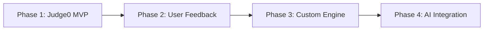

# Online IDE Platform - TODO List

## 🎯 Project Overview
**Goal**: Build a web-based IDE like LeetCode/HackerRank with multi-language support, syntax checking, and secure code execution.

**Tech Stack**:
- **Frontend**: React + TypeScript + Monaco Editor + Tailwind CSS
- **Backend**: Python + FastAPI + PostgreSQL + Redis
- **Execution**: Docker containers with security sandboxing
- **Deployment**: Railway.app with Docker containerization
- **AI Integration**: Planned for future phases

---

## 📋 Development Phases

### Phase 1: Frontend Foundation (Week 1-2)
- [ ] **Project Setup**
  - [ ] Initialize React project with Vite + TypeScript
  - [ ] Install and configure Tailwind CSS
  - [ ] Set up ESLint and Prettier
  - [ ] Configure project structure and folders

- [ ] **Monaco Editor Integration**
  - [ ] Install Monaco Editor for React
  - [ ] Configure syntax highlighting for multiple languages
  - [ ] Implement language switching (Python, JavaScript, Java, C++, Go)
  - [ ] Add dark/light theme support
  - [ ] Configure IntelliSense and autocomplete

- [ ] **Core UI Components**
  - [ ] Create responsive layout with sidebar and main area
  - [ ] Build language selector dropdown
  - [ ] Design code input area with Monaco
  - [ ] Create output/console panel
  - [ ] Add run button with loading states
  - [ ] Implement error display component
  - [ ] Add file management (save/load) interface

- [ ] **State Management**
  - [ ] Set up Zustand for global state
  - [ ] Create stores for:
    - [ ] Current code content
    - [ ] Selected language
    - [ ] Execution results
    - [ ] Error states
    - [ ] User preferences

### Phase 2: Python Backend Development (Week 3-4)
- [ ] **FastAPI Setup**
  - [ ] Initialize FastAPI project
  - [ ] Configure CORS for frontend integration
  - [ ] Set up project structure (routes, models, services)
  - [ ] Add environment configuration with Pydantic Settings
  - [ ] Implement request/response models

- [ ] **Database Integration**
  - [ ] Set up PostgreSQL with SQLAlchemy
  - [ ] Create database models:
    - [ ] Users (for future auth)
    - [ ] Code submissions
    - [ ] Execution history
    - [ ] Language templates
  - [ ] Implement database migrations with Alembic
  - [ ] Add connection pooling and async support

- [ ] **Redis Caching**
  - [ ] Configure Redis for session management
  - [ ] Implement caching for:
    - [ ] Execution results (temporary)
    - [ ] Language templates
    - [ ] User sessions
  - [ ] Add cache invalidation strategies

- [ ] **Core API Endpoints**
  - [ ] `POST /api/code/execute` - Execute user code
  - [ ] `POST /api/code/validate` - Syntax checking
  - [ ] `GET /api/languages` - Supported languages list
  - [ ] `GET /api/templates/{language}` - Code templates
  - [ ] `POST /api/code/save` - Save code snippets
  - [ ] `GET /api/code/{id}` - Retrieve saved code

### Phase 3: Secure Code Execution Engine (Week 5-6)
- [ ] **Docker Execution Environment**
  - [ ] Create base Docker images for each language:
    - [ ] Python 3.11 with common packages (numpy, pandas, requests)
    - [ ] Node.js 18 with npm packages
    - [ ] OpenJDK 17 for Java
    - [ ] GCC for C++
    - [ ] Go 1.21
  - [ ] Implement resource limits (CPU, memory, time)
  - [ ] Configure network isolation
  - [ ] Set up temporary file systems

- [ ] **Security Measures**
  - [ ] Implement code execution sandboxing
  - [ ] Add input sanitization and validation
  - [ ] Configure process limits (prevent fork bombs)
  - [ ] Implement file access restrictions
  - [ ] Add execution timeout mechanisms
  - [ ] Create audit logging for all executions

- [ ] **Execution Service**
  - [ ] Build async execution handler
  - [ ] Implement queue system for concurrent executions
  - [ ] Add result parsing and error handling
  - [ ] Create execution status tracking
  - [ ] Implement cleanup mechanisms
  - [ ] Add performance monitoring

### Phase 4: Language Support & Features (Week 7-8)
- [ ] **Multi-Language Implementation**
  - [ ] **Python Support**
    - [ ] Standard library access
    - [ ] Popular packages (numpy, pandas, matplotlib)
    - [ ] Error parsing and line mapping
  - [ ] **JavaScript/Node.js Support**
    - [ ] ES6+ syntax support
    - [ ] Common npm packages
    - [ ] Console.log output capture
  - [ ] **Java Support**
    - [ ] Compilation and execution
    - [ ] Maven dependency support (basic)
    - [ ] Stack trace parsing
  - [ ] **C++ Support**
    - [ ] GCC compilation
    - [ ] Standard libraries
    - [ ] Compilation error parsing
  - [ ] **Go Support**
    - [ ] Go modules support
    - [ ] Error handling and output

- [ ] **Advanced Features**
  - [ ] Real-time syntax checking
  - [ ] Import statement support
  - [ ] Code formatting (prettier/black integration)
  - [ ] Performance metrics display
  - [ ] Memory usage tracking

### Phase 5: AI Integration Preparation (Week 9-10)
- [ ] **AI Infrastructure Setup**
  - [ ] Research and select AI models for:
    - [ ] Code completion
    - [ ] Error detection and suggestions
    - [ ] Code optimization hints
    - [ ] Bug finding
  - [ ] Set up model serving infrastructure
  - [ ] Implement API endpoints for AI features

- [ ] **Integration Points**
  - [ ] Add AI suggestion panel to UI
  - [ ] Implement code analysis endpoints
  - [ ] Create feedback collection system
  - [ ] Add model inference caching

### Phase 6: Docker & Railway Deployment (Week 11-12)
- [ ] **Containerization**
  - [ ] Create multi-stage Dockerfile for frontend
  - [ ] Create Dockerfile for FastAPI backend
  - [ ] Set up docker-compose for local development
  - [ ] Configure environment variables
  - [ ] Optimize image sizes and build times

- [ ] **Railway Deployment**
  - [ ] Configure Railway project
  - [ ] Set up PostgreSQL database on Railway
  - [ ] Configure Redis instance
  - [ ] Set up environment variables
  - [ ] Configure domain and SSL
  - [ ] Set up monitoring and logging

- [ ] **Production Optimizations**
  - [ ] Implement health checks
  - [ ] Add application metrics
  - [ ] Configure auto-scaling
  - [ ] Set up error tracking (Sentry)
  - [ ] Implement backup strategies

---

## 🔒 Security Checklist
- [ ] **Code Execution Security**
  - [ ] Docker container isolation
  - [ ] Resource limits (CPU: 1 core, RAM: 256MB, Time: 30s)
  - [ ] Network isolation (no external requests)
  - [ ] File system restrictions
  - [ ] Process limitation (prevent fork bombs)

- [ ] **Input Validation**
  - [ ] Code size limits (max 10KB)
  - [ ] Malicious pattern detection
  - [ ] SQL injection prevention
  - [ ] XSS protection
  - [ ] Rate limiting (5 executions/minute per user)

- [ ] **Infrastructure Security**
  - [ ] HTTPS enforcement
  - [ ] Secure environment variable handling
  - [ ] Database connection encryption
  - [ ] Regular security audits

---

## 🚀 Future Enhancements (Post-MVP)
- [ ] **User Management**
  - [ ] User authentication (JWT)
  - [ ] Personal code storage
  - [ ] Execution history
  - [ ] Usage analytics

- [ ] **Advanced Features**
  - [ ] Collaborative editing
  - [ ] Code sharing via URLs
  - [ ] Contest mode
  - [ ] Performance benchmarking
  - [ ] Custom test cases

- [ ] **AI Features**
  - [ ] Intelligent code completion
  - [ ] Bug detection and fixes
  - [ ] Code optimization suggestions
  - [ ] Natural language to code conversion

---

## 📊 Success Metrics
- [ ] **Performance**
  - [ ] Code execution time < 30 seconds
  - [ ] UI response time < 200ms
  - [ ] 99.9% uptime
  - [ ] Support for 50+ concurrent users

- [ ] **Security**
  - [ ] Zero security incidents
  - [ ] All code executions properly sandboxed
  - [ ] Regular security assessments passed

- [ ] **User Experience**
  - [ ] Intuitive interface
  - [ ] Fast syntax checking
  - [ ] Clear error messages
  - [ ] Mobile responsive design

---

## 🔧 Development Commands
```bash
# Frontend Development
npm create vite@latest frontend -- --template react-ts
cd frontend && npm install
npm install @monaco-editor/react tailwindcss
npm run dev

# Backend Development
python -m venv venv
source venv/bin/activate  # or venv\Scripts\activate on Windows
pip install fastapi uvicorn sqlalchemy psycopg2-binary redis
uvicorn main:app --reload

# Docker Commands
docker build -t online-ide-frontend ./frontend
docker build -t online-ide-backend ./backend
docker-compose up -d
```

---

## 📚 Research & Resources
- [x] Study Judge0 API integration options ✅ **RECOMMENDED FOR MVP**
- [ ] Research Monaco Editor advanced features
- [x] Investigate FastAPI best practices ✅ **CONFIRMED: Best choice for AI integration**
- [ ] Review Railway.app deployment guides
- [ ] Explore AI model integration patterns

### 🎯 **Strategic Decision: MVP vs Production**

**MVP Path (2-3 weeks):**
- Use Judge0 API for code execution (faster to market)
- Self-host Judge0 on Railway or use Judge0 CE
- Focus on UI/UX and basic functionality

**Production Path (4-6 weeks):**
- Build custom Docker execution engine
- Full control over execution environment
- Better AI integration possibilities
- More security customization

**Recommended Approach:** Start with Judge0 for MVP, then migrate to custom solution

## 🏗️ **Technical Architecture Decision Matrix**

| Feature | Judge0 API | Custom Docker | Recommendation |
|---------|------------|---------------|----------------|
| **Time to MVP** | ⭐⭐⭐⭐⭐ (1-2 weeks) | ⭐⭐ (4-6 weeks) | Start with Judge0 |
| **AI Integration** | ⭐⭐ (Limited) | ⭐⭐⭐⭐⭐ (Full control) | Custom for AI |
| **Security Control** | ⭐⭐⭐⭐ (Battle-tested) | ⭐⭐⭐⭐⭐ (Full control) | Both excellent |
| **Maintenance** | ⭐⭐⭐⭐⭐ (Minimal) | ⭐⭐ (Ongoing) | Judge0 easier |
| **Customization** | ⭐⭐ (Limited) | ⭐⭐⭐⭐⭐ (Unlimited) | Custom wins |
| **Cost** | ⭐⭐⭐ (API calls) | ⭐⭐⭐⭐ (Infrastructure) | Custom cheaper at scale |

### 🎯 **Phase-Based Approach (RECOMMENDED)**



**Phase 1 Benefits:**
- Validate product-market fit quickly
- Learn user behavior patterns
- Generate revenue early
- Test Railway deployment pipeline

**Phase 2+ Benefits:**
- Full control for AI features
- Custom optimizations
- Better cost structure
- Unique competitive advantages

## 💡 Notes & Ideas
- Consider using Judge0 API for initial MVP to speed up development
- Implement progressive web app (PWA) features for offline coding
- Add keyboard shortcuts for better developer experience
- Consider WebAssembly for client-side code execution in future
- Plan for horizontal scaling on Railway
- **NEW**: Use Judge0's execution flow as a blueprint for custom engine
- **NEW**: Implement feature flags to switch between Judge0 and custom engine
- **NEW**: Consider hybrid approach - Judge0 for some languages, custom for AI-enhanced ones

## 🚀 **Immediate Next Steps (Start Here)**

### **Day 1-2: Project Setup**
```bash
# 1. Initialize project structure
mkdir online-ide-platform && cd online-ide-platform
mkdir frontend backend docs

# 2. Frontend setup
cd frontend
npm create vite@latest . -- --template react-ts
npm install @monaco-editor/react tailwindcss zustand axios

# 3. Backend setup  
cd ../backend
python -m venv venv
source venv/bin/activate
pip install fastapi uvicorn sqlalchemy psycopg2-binary redis python-multipart

# 4. Documentation
cp TODO.md ../docs/
```

### **Week 1 Priority Tasks**
1. ✅ Complete research and planning (DONE)
2. 🔧 Set up development environment
3. 🎨 Create basic React + Monaco Editor integration
4. 🐍 Build FastAPI skeleton with basic endpoints
5. 🐳 Create initial Docker setup for local development

### **Decision Required:** Choose Your Path
- **🚀 Fast Track (Judge0)**: Get MVP in 2-3 weeks, perfect for validation
- **🏗️ Custom Track**: Build from scratch, 6-8 weeks, better for AI future

**My Recommendation**: Start with Judge0 track - you can always migrate later once you validate the concept and understand user needs.

---

**Last Updated**: December 2024  
**Status**: Planning Phase Complete ✅  
**Priority**: High - Strategic project for AI integration  
**Next Phase**: Ready for implementation 🚀
